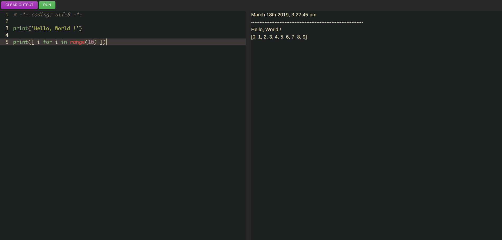

# Blackphantom


Write code directly on the web page and return to the web page after the server executes.Separate the front end from the server and run multiple servers. The best route selection is currently being developed to accommodate the use of multiple multiple lines.


## Screenshot




## Usage

You can use docker-compose to run the frontend and backend directly.

```bash
docker-compose up -d
```

Then you can go to the 8000 port.

Of course, you can also choose to build the image yourself using the source code. Both Dockerfile and source code are included.


## License

MIT License. Copyright (c) 2019 kuari.


